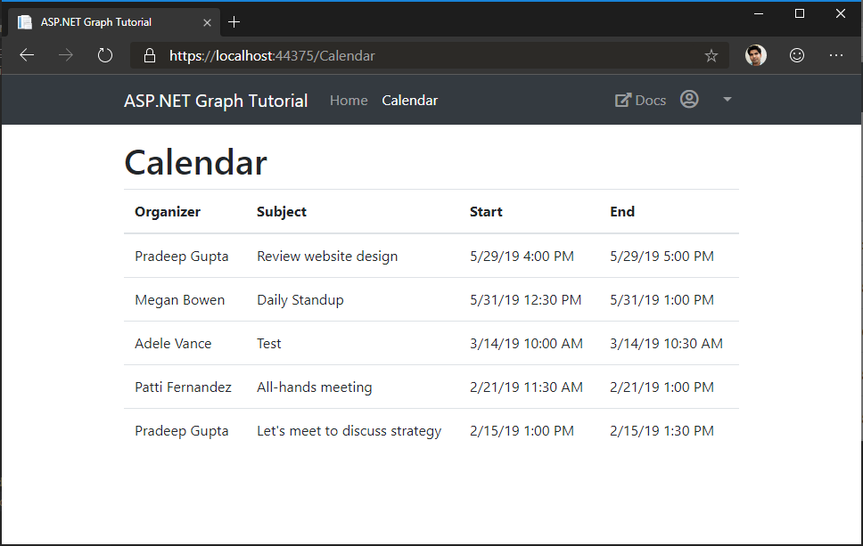

<!-- markdownlint-disable MD002 MD041 -->

In this demo you will incorporate the Microsoft Graph into the application. For this application, you will use the [Microsoft Graph Client Library for .NET](https://github.com/microsoftgraph/msgraph-sdk-dotnet) to make calls to Microsoft Graph.

## Get calendar events from Outlook

Start by extending the `GraphHelper` class you created in the last module.

1. Add the following `using` statements to the top of the `Helpers/GraphHelper.cs` file.

    ```cs
    using graph_tutorial.TokenStorage;
    using Microsoft.Identity.Client;
    using System.Collections.Generic;
    using System.Configuration;
    using System.Linq;
    using System.Security.Claims;
    using System.Web;
    ```

1. Add the following code to the `GraphHelper` class.

    ```cs
    // Load configuration settings from PrivateSettings.config
    private static string appId = ConfigurationManager.AppSettings["ida:AppId"];
    private static string appSecret = ConfigurationManager.AppSettings["ida:AppSecret"];
    private static string redirectUri = ConfigurationManager.AppSettings["ida:RedirectUri"];
    private static string graphScopes = ConfigurationManager.AppSettings["ida:AppScopes"];

    public static async Task<IEnumerable<Event>> GetEventsAsync()
    {
        var graphClient = GetAuthenticatedClient();

        var events = await graphClient.Me.Events.Request()
            .Select("subject,organizer,start,end")
            .OrderBy("createdDateTime DESC")
            .GetAsync();

        return events.CurrentPage;
    }

    private static GraphServiceClient GetAuthenticatedClient()
    {
        return new GraphServiceClient(
            new DelegateAuthenticationProvider(
                async (requestMessage) =>
                {
                    var idClient = ConfidentialClientApplicationBuilder.Create(appId)
                        .WithRedirectUri(redirectUri)
                        .WithClientSecret(appSecret)
                        .Build();

                    string signedInUserId = ClaimsPrincipal.Current.FindFirst(ClaimTypes.NameIdentifier).Value;
                    var tokenStore = new SessionTokenStore(signedInUserId, HttpContext.Current);
                    tokenStore.Initialize(idClient.UserTokenCache);

                    var accounts = await idClient.GetAccountsAsync();

                    // By calling this here, the token can be refreshed
                    // if it's expired right before the Graph call is made
                    var scopes = graphScopes.Split(' ');
                    var result = await idClient.AcquireTokenSilent(scopes, accounts.FirstOrDefault())
                        .ExecuteAsync();

                    requestMessage.Headers.Authorization =
                        new AuthenticationHeaderValue("Bearer", result.AccessToken);
                }));
    }
    ```

    Consider what this code is doing.

    - The `GetAuthenticatedClient` function initializes a `GraphServiceClient` with an authentication provider that calls `AcquireTokenSilent`.
    - In the `GetEventsAsync` function:
      - The URL that will be called is `/v1.0/me/events`.
      - The `Select` function limits the fields returned for each events to just those the view will actually use.
      - The `OrderBy` function sorts the results by the date and time they were created, with the most recent item being first.

Now create a controller for the calendar views.

1. Right-click the **Controllers** folder in Solution Explorer and choose **Add > Controller...**. Choose **MVC 5 Controller - Empty** and choose **Add**. Name the controller `CalendarController` and choose **Add**. Replace the entire contents of the new file with the following code.

    ```cs
    using System;
    using graph_tutorial.Helpers;
    using System.Threading.Tasks;
    using System.Web.Mvc;

    namespace graph_tutorial.Controllers
    {
        public class CalendarController : BaseController
        {
            // GET: Calendar
            [Authorize]
            public async Task<ActionResult> Index()
            {
                var events = await GraphHelper.GetEventsAsync();

                // Change start and end dates from UTC to local time
                foreach (var ev in events)
                {
                    ev.Start.DateTime = DateTime.Parse(ev.Start.DateTime).ToLocalTime().ToString();
                    ev.Start.TimeZone = TimeZoneInfo.Local.Id;
                    ev.End.DateTime = DateTime.Parse(ev.End.DateTime).ToLocalTime().ToString();
                    ev.End.TimeZone = TimeZoneInfo.Local.Id;
                }

                return Json(events, JsonRequestBehavior.AllowGet);
            }
        }
    }
    ```

1. Start the app, sign in, and click the **Calendar** link in the nav bar. If everything works, you should see a JSON dump of events on the user's calendar.

## Display the results

Now you can add a view to display the results in a more user-friendly manner.

1. In Solution Explorer, right-click the **Views/Calendar** folder and choose **Add > View...**. Name the view `Index` and choose **Add**. Replace the entire contents of the new file with the following code.

    ```html
    @model IEnumerable<Microsoft.Graph.Event>

    @{
        ViewBag.Current = "Calendar";
    }

    <h1>Calendar</h1>
    <table class="table">
        <thead>
            <tr>
                <th scope="col">Organizer</th>
                <th scope="col">Subject</th>
                <th scope="col">Start</th>
                <th scope="col">End</th>
            </tr>
        </thead>
        <tbody>
            @foreach (var item in Model)
            {
                <tr>
                    <td>@item.Organizer.EmailAddress.Name</td>
                    <td>@item.Subject</td>
                    <td>@Convert.ToDateTime(item.Start.DateTime).ToString("M/d/yy h:mm tt")</td>
                    <td>@Convert.ToDateTime(item.End.DateTime).ToString("M/d/yy h:mm tt")</td>
                </tr>
            }
        </tbody>
    </table>
    ```

    That will loop through a collection of events and add a table row for each one.

1. Remove the `return Json(events, JsonRequestBehavior.AllowGet);` line from the `Index` function in `Controllers/CalendarController.cs`, and replace it with the following code.

    ```cs
    return View(events);
    ```

1. Start the app, sign in, and click the **Calendar** link. The app should now render a table of events.

    
